# Budget Project VBA

## ภาพรวม

โปรเจกต์นี้ใช้ Excel VBA สร้างไฟล์งบประมาณประกันภัย `.xlsx` จาก Workbook ต้นแบบ โดยอ่านการตั้งค่าจากชีท MasterMapping, เลือกข้อมูลตาม Profit Center และ Reviewer, คัดลอกชีทต้นแบบ, เติมข้อมูลและสูตร แล้วบันทึกแยกไฟล์

Workbook ต้นแบบที่เกี่ยวข้อง: `Template_Insurance_Budget 2027v.1.2.xlsb`

## ไฟล์หลัก

- `[Insurance] Gen_by_Reviewer.vb` — สร้างหนึ่ง Workbook ต่อ Reviewer; รองรับชีท `(M)`, standalone `(T)` และ `(R)`
- `note.vb` — ตัวอย่างสูตรที่อ้างอิง Table `Sale_Target` และชีท `Sale Target (R)`
- `Logs.txt` — ตัวอย่างผล Log จากการรัน; ใช้ตรวจ error และเวลาประมวลผล

## MasterMapping

แมโคร Reviewer เลือกชื่อชีท Mapping จาก `Action_Page!A6` แล้วอ่านข้อมูลช่วง `A5:AR` ถึงแถวสุดท้ายในคอลัมน์ A

| ตำแหน่ง | ความหมายตามการใช้งาน |
|---|---|
| แถว 2 | ชื่อชีท Master `(M)` |
| แถว 3 | ชื่อชีท Template `(T)` |
| แถว 4 | ชื่อชีท Report `(R)` |
| คอลัมน์ A | Profit Center ID |
| คอลัมน์ B | Profit Center Name |
| คอลัมน์ C | Flag เลือกสร้างไฟล์ |
| คอลัมน์ D เป็นต้นไป | Flag เลือกชีทสำหรับ Profit Center |
| คอลัมน์ AD | โฟลเดอร์ปลายทาง |
| คอลัมน์ AE | Reviewer |
| คอลัมน์ AF | ค่า override ที่เขียนลงคอลัมน์ A ของชีท `(M)` |

คอลัมน์สุดท้ายของการตั้งค่าชีทคำนวณจากแถว 2–4 ส่วนข้อมูล PC เริ่มจากแถว 5

## Flow: Reviewer

1. จับค่า Application settings เดิม, แสดง progress form แล้วคำนวณทุก worksheet ใน `ThisWorkbook`
2. ปิด Events/Alerts, เริ่ม Log, อ่านชื่อ MasterMapping จาก `Action_Page!A6` แล้วโหลดข้อมูล Mapping
3. สแกนแถว 2–4 เพื่อสร้าง mapping ของ `(M)/(T)/(R)`
4. โหลดข้อมูลทุกชีท `(M)` โดยใช้คอลัมน์ B หาแถวสุดท้าย และจัดกลุ่ม Profit Center ID เป็น Dictionary ของ row indexes
5. จัดกลุ่มแถว MasterMapping ที่คอลัมน์ C เป็น TRUE ตามชื่อ Reviewer ในคอลัมน์ AE
6. สร้าง Workbook หนึ่งไฟล์ต่อ Reviewer
7. สำหรับแต่ละคอลัมน์ชีทที่เลือก: ถ้า row 2 ระบุ `(M)` จะคัดลอก `(M)` หรือใช้ `(T)` เป็น template เมื่อไม่พบ `(M)` แล้วเติมได้เมื่อโหลด Master `(M)` data สำเร็จ; ถ้า row 2 ว่างจึงพิจารณา standalone `(R)/(T)`
8. ชีท `(M)` ถูก Duplicate, ล้าง contents แถว 2 ถึงแถวสุดท้ายที่อ้างอิงจากคอลัมน์ B แล้วรวบรวม record ของ PC ที่เลือกพร้อม source row index
9. เขียน values ก่อน โดยคอลัมน์ A รับ AF, B รับ PC ID, C รับ PC Name; อ่านสูตรจาก source row ของแต่ละ record เฉพาะคอลัมน์ D เป็นต้นไป แล้วเขียนลง output row ที่ตรงกัน สูตรที่ติดกันเขียนเป็นช่วงและ fallback ทีละเซลล์หากช่วงล้มเหลว
10. standalone `(R)` ถูก Duplicate, แปลง UsedRange เป็นค่า, แปลง Table เป็น range และใช้ AutoFilter; standalone `(T)` ถูก Duplicate โดยคงค่า สูตร และ format จากนั้นคืนสูตรจากต้นฉบับอีกครั้งหลังคัดลอกชีทที่ map ครบ
11. ลบชีทเริ่มต้น, ล้างแถวส่วนเกินเฉพาะชีทที่ไม่ใช่ `(R)/(T)`, ป้องกันชีท แล้วบันทึกเมื่อมี output path; ถ้า path ว่างหรือสร้างโฟลเดอร์/บันทึกไม่สำเร็จ จะ log และปิด Workbook โดยไม่บันทึก
12. Cleanup คืน Application settings เดิมและปล่อย object/array; เมื่อสำเร็จแสดงข้อความจบงาน แต่เมื่อเกิด unexpected runtime error จะ log, ปิดฟอร์ม, แจ้ง error และคง Workbook ที่กำลังสร้างไว้เปิดตรวจสอบ

ชื่อไฟล์ใช้ชื่อ Reviewer และบันทึกในโฟลเดอร์จากคอลัมน์ AD ของแถวแรกในกลุ่ม Reviewer หากชื่อไฟล์ซ้ำจะเพิ่มเลขลำดับ

### Sequence Diagram: Reviewer

```mermaid
sequenceDiagram
    actor User
    participant Macro as genfile_ByReviewer_V11_WithLog
    participant Mapping as Action_Page / MasterMapping
    participant Source as ThisWorkbook Sheets
    participant Progress as frmProgress
    participant Output as New Workbook
    participant FileSystem as FileSystemObject

    User->>Macro: Run macro
    activate Macro
    Macro->>Macro: Capture current Application settings, disable ScreenUpdating, and set Calculation to Manual
    Macro->>Progress: Show modeless form and start elapsed timer
    loop Each worksheet in ThisWorkbook
        Macro->>Progress: Show worksheet name and refresh elapsed time
        Macro->>Source: Calculate worksheet
    end
    Macro->>Macro: Disable Events and Alerts
    Macro->>Mapping: Read Action_Page!A6
    Mapping-->>Macro: MasterMapping sheet name
    Macro->>Mapping: Load A5:AR through last row in column A
    Macro->>Mapping: Read sheet mappings from rows 2-4

    loop Each source sheet with (M) and data
        Macro->>Source: Read rows 2:last row using column B
        Source-->>Macro: 2D data array
        Macro->>Macro: Group row indexes by Profit Center ID
    end

    Macro->>Macro: Group selected mapping rows by Reviewer (C=TRUE, AE has name)
    Macro->>Progress: Show modeless form and initialize progress labels

    loop Each Reviewer
        Macro->>Output: Create a new workbook
        Macro->>Progress: Update file count, elapsed time, and process UI events

        loop Each selected sheet column (D:last mapping column)
            Macro->>Mapping: Read row 2 (M), row 3 (T), row 4 (R)
            Macro->>Macro: Check whether any PC for this Reviewer selected the column
            alt Column selected and row 2 names an (M) sheet
                Macro->>Source: Copy selected source/template sheet
                Source-->>Output: Duplicate sheet named with (M)
                Macro->>Output: Clear rows 2:last row from source column B
                alt Master (M) data was loaded
                    Macro->>Source: Retrieve selected PC row indexes and Master values
                    Source-->>Macro: Ordered values and source row indexes
                    Macro->>Output: Write filtered values and override A/B/C from AF and PC mapping
                    loop Each selected output record
                        Macro->>Source: Read FormulaR1C1 from that record's actual Master row
                        Macro->>Macro: Keep only source formulas in columns D:last column
                    end
                    Macro->>Output: Write formulas to their matching output rows in contiguous blocks
                    opt Formula block write fails
                        Macro->>Output: Retry formulas cell by cell
                        Macro->>Macro: Log remaining failures with address, formula, and error
                    end
                else Master (M) data missing
                    Macro->>Macro: Log warning and leave copied sheet without PC rows
                end
            else Column selected and row 2 is blank
                opt Row 4 names an (R) sheet
                    Macro->>Source: Copy standalone (R) sheet
                    Source-->>Output: Duplicate sheet with original formatting
                    Macro->>Output: Replace UsedRange formulas with current values
                    Macro->>Output: Unlist copied Tables and apply AutoFilter to UsedRange
                end
                opt Row 3 names a (T) sheet
                    Macro->>Source: Copy standalone (T) sheet
                    Source-->>Output: Duplicate sheet with values, formulas, and formatting
                end
            end
        end

        loop Each copied standalone (T) sheet
            Macro->>Source: Read formula cells from original (T) sheet
            Macro->>Output: Reapply formulas after all mapped sheets are copied
        end

        Macro->>Output: Delete default sheets and trim unused rows on non-(R)/(T) sheets
        Macro->>Output: Protect worksheets
        alt Output path provided
            Macro->>FileSystem: Ensure Reviewer output folder exists
            alt Folder creation fails
                Macro->>Mapping: Log folder error
                Macro->>Output: Close workbook without saving
            else Folder available
                Macro->>Output: SaveAs .xlsx using Reviewer name
                opt SaveAs fails
                    Macro->>Mapping: Log save error
                end
                Macro->>Output: Close workbook
            end
        else Output path missing
            Macro->>Mapping: Log missing path
            Macro->>Output: Close workbook without saving
        end
    end

    alt Normal completion
        Macro->>Macro: Restore captured Application settings
        Macro->>Macro: Release object and array references
        Macro->>Progress: Show completion briefly, then unload
        Macro-->>User: Show completion message
        Macro->>Mapping: Append final log and AutoFit columns once
    else Unexpected VBA runtime error
        Macro->>Mapping: Log error number, source, and description
        Macro->>Macro: Restore captured Application settings and release object/array references
        Macro->>Progress: Unload progress form and display error
        Note over Output: Leave any partial output workbook open for inspection
    end
    deactivate Macro
```

## Flow: Cost Center

แมโคร `genfile_ByProfitCenter_V1_9` สร้างหนึ่ง Workbook ต่อ Profit Center ที่เลือกในคอลัมน์ C มี logic สำหรับคัดลอก `(R)` เป็นค่าและรักษา format, จัดการ `(T)` แบบไม่มี `(M)`, และเติมข้อมูลลงชีท `(M)` รูปแบบนี้ใช้เป็นข้อมูลอ้างอิงได้ แต่ไม่ควรคัดลอก logic โดยไม่ตรวจความต่างของระดับการสร้างไฟล์

## สูตรและการอ้างอิง

- สูตรต้นทางของชีท `(M)` อ่านด้วย `FormulaR1C1` จากแถว Master จริงที่เลือกให้แต่ละ record/PC แล้วจับคู่ลง output row เดียวกัน; สูตรไม่ได้ fill-down จาก template row 2
- คอลัมน์ A:C ของ output `(M)` ยังคงเป็น override จาก AF, PC ID และ PC Name ตามเดิม; สูตรจาก Master จะถูกคัดลอกเฉพาะคอลัมน์ตั้งแต่ D เป็นต้นไป
- การเขียนสูตรแบบช่วงหรือทีละเซลล์ยังคงเป็นสูตร ไม่ใช่การแปลงเป็นค่า
- สูตรที่อ้างถึงชีทหรือ Table เช่น `Sale_Target` ต้องมีชีท/Table ชื่อนั้นใน Workbook ผลลัพธ์ และชื่อคอลัมน์ต้องตรงกัน
- Reviewer loop คัดลอกและเติมชีทตามลำดับคอลัมน์ Mapping หากสูตรอ้างถึงชีท/Table ที่ยังไม่ได้คัดลอก อาจเกิด reference หรือ formula error ได้
- Reviewer macro ตั้ง Calculation เป็น Manual แล้วสั่ง Calculate ทีละ worksheet ใน `ThisWorkbook` ก่อนอ่าน Mapping และคัดลอกชีท; การแปลง `(R)` เป็นค่าจึงใช้ผลคำนวณที่มี ณ เวลาคัดลอก

## Memory, Performance และ Error Handling

- Dictionary หลักเก็บ row indexes แยกตาม Master sheet และ Profit Center; ข้อมูล 2D ของชีทที่กำลังสร้างถูกโหลดซ้ำและ Erase หลังใช้งาน
- ข้อมูล 20,000 แถวหลายชีทและการสร้างหลาย Reviewer ยังใช้หน่วยความจำสูงได้ ควรตรวจ peak memory และเวลารันจาก Log/Task Manager
- สูตรถูกเขียนเป็น contiguous blocks ก่อน; หากล้มเหลวจะ fallback ทีละเซลล์ Log สูตรที่ยังเขียนไม่ได้ พร้อม Err.Number, address และสูตรตัวอย่าง
- Log ถูกล้างตั้งแต่ A2:E เมื่อเริ่มงาน และ AutoFit คอลัมน์ครั้งเดียวหลัง Log สุดท้าย
- Reviewer macro จับค่าเดิมของ `ScreenUpdating`, `Calculation`, `EnableEvents` และ `DisplayAlerts` แล้วคืนค่าทั้งหมดเมื่อจบงานหรือเกิด runtime error; การคืน Calculation เป็น Automatic อาจทำให้ Excel คำนวณสูตรใหม่
- Reviewer macro มี procedure-level error handler ซึ่งบันทึกและแจ้ง unexpected VBA runtime errors, คืนค่า Application settings และปิด progress form; workbook ผลลัพธ์ที่ยังไม่บันทึกจะคงเปิดไว้ตรวจสอบ
- Handler นี้ไม่สามารถกู้คืน Excel จาก process crash, OS termination หรือการค้างภายในคำสั่ง Calculate แบบ synchronous

## แนวทางแก้ไขในอนาคต

- เมื่อเปลี่ยนตำแหน่งหรือความหมายคอลัมน์ Mapping ให้ตรวจทั้งจุดโหลด Mapping, grouping และ loop สร้างไฟล์
- เมื่อเปลี่ยนสูตร ให้ทดสอบสูตรธรรมดา, สูตรที่มีช่องว่างระหว่างแถว, structured references และสูตรที่อ้างถึงชีทอื่น
- เมื่อเปลี่ยนลำดับการ Duplicate ชีท ให้ตรวจว่า dependency sheets และ Tables ถูกสร้างก่อนเขียนสูตร
- เมื่อปรับ memory ให้รักษาลำดับ row indexes, การกรอง PC/Reviewer และการแทนค่า AF/B/C ให้เหมือนเดิม
- ทดสอบอย่างน้อยกรณีมี `(M)`, มี `(M)` พร้อม `(T)`, standalone `(R)`, standalone `(T)` และหลาย Reviewer
- หลังรัน ตรวจ Log ว่าบันทึกไฟล์สำเร็จ, ไม่มี formula block/fallback failures และ Workbook output มีชื่อชีท/Table ที่สูตรอ้างถึง